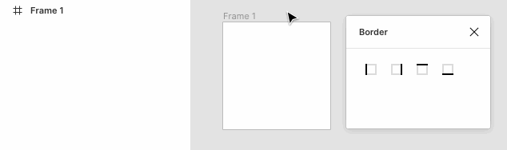

<p align="center">Quickly add single borders in Frame.</p>
<p align="center"></p>



## Installation

You can install it through the Figma App [here](https://www.figma.com/c/plugin/740014625507871586/Border)


## Usage
1. Open **Border** from the plugin menu.
2. Select one or more frames.
3. Click button to toggle borders.


## Development
```
Gulp
|- Rollup + Svelte
|- Sass
|- inline-source
```

```npm run dev```
or
```npm run build```


## License
[MIT](http://opensource.org/licenses/MIT)
